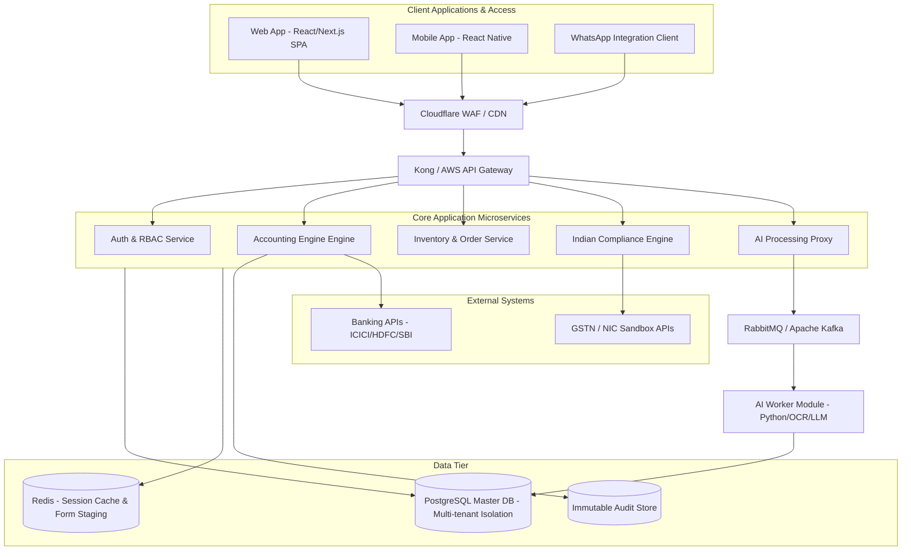
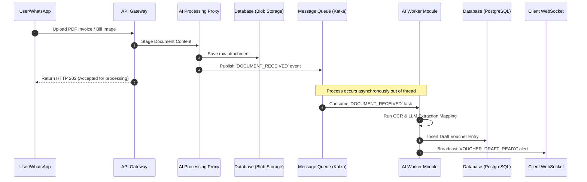

---

### `Architecture.md`
*(Note: This uses standard Markdown text structures along with native **Mermaid.js** code blocks, which render as rich visual flowcharts on GitHub, GitLab, VS Code, and modern markdown viewers).*

```markdown
# High-Level Architecture Blueprint: SmartBooks AI ERP

This document outlines the cloud-native, microservices-driven architecture required to meet the strict sub-50ms user interface requirements and data-isolation paradigms of SmartBooks AI ERP.

---

## 1. System Topology Map

The system utilizes an API Gateway layer to abstract microservices, routing compute-heavy asynchronous tasks (like AI parsing) into separate workers via message queues to avoid locking the transactional accounting thread.



---

## 2. Structural Layer Breakdowns

### 2.1 UI Entry Layer (Engineered for Low Latency)
* **Technology Stack:** Next.js Single Page Application (SPA) deployed to edge cloud networks.
* **Input Interceptor Cache:** Intercepts every local user keystroke event. Prioritizes state modification inside local JavaScript memory state arrays *before* sending network confirmation. This ensures the 50ms user entry target requirement is reached irrespective of regional cloud round-trip hops.

### 2.2 Microservices Fabric
* **Core Application Services:** Developed utilizing high-concurrency runtimes (Go or optimized Node.js clusters).
* **Service Isolation Principle:** The `Accounting Engine Engine` remains structurally detached from inventory updates. It consumes data streams from the `Inventory & Order Service` asynchronously via webhook events to guarantee book accuracy during volume traffic spikes.

### 2.3 AI Document Ingestion Engine (Asynchronous Queue)


### 2.4 Persistence & Audit Strategy
* **Operational Relational Database:** PostgreSQL clusters configured using Row-Level Security (RLS) tracking tables to isolate data records matching separate corporate workspace configurations (`Tenant IDs`).
* **Session Staging DB:** Redis in-memory storage holding temporary un-saved form lines. If an internet drop hits, local data sets sync up directly with this structure.
* **The Ledger Audit Ledger:** PostgreSQL tables bound to internal immutable