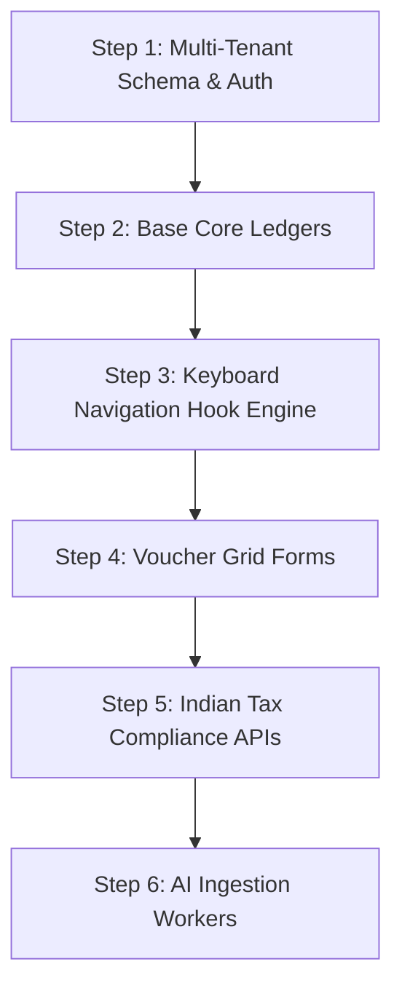

# Team Execution & AI Coding Instructions

This file serves as the definitive engineering checklist for human developers and AI code editors during the development sprints of SmartBooks AI ERP.

---

## 1. Workspace Verification Checklist

Before writing any feature code block, verify that your workspace setup satisfies these constraints:
* **Tenant Isolation:** Ensure that your global API authentication token injects a dynamic context parameter containing the active `tenant_id` to your database client wrapper.
* **Typing Rigor:** Enforce a strict type rule checking structure. Prohibit the use of explicit `any` tags across model interfaces.
* **Audit Trail Hook:** Confirm that any code that edits, patches, or deletes database tables linked to accounting vouchers has an accompanying append-only audit tracking statement.

---

## 2. Sprint Blueprint: Core Development Steps

Execute the development of the platform sequentially to ensure system dependencies resolve reliably.

### Step 1: Database Setup and Core Tenant Routing
* Establish your PostgreSQL structure with Row-Level Security profiles enabled.
* Build the `users`, `tenants`, and `branches` structures. 
* Implement custom authorization middleware components designed to extract company identification payloads out of application header strings.

### Step 2: Core Ledgers and The MCA Audit Log
* Write the relational tables for `ledgers`, `ledger_groups`, and `vouchers`.
* Set up a permanent, unalterable database trigger profile on your voucher tracking architecture. Any update string execution must map the preceding record values over to your `mca_audit_log` target space.

### Step 3: Zero-Mouse Keyboard Layout Integration
* Instantiate the global `KeyboardNavigationContext` module component in the base folder wrapper of your Next.js application framework.
* Map functional keys (`F4` through `F9`) directly onto your system router engine to drive views transitions instantly without requiring mouse movement.

### Step 4: Low-Latency Voucher Entry Forms
* Build out the multi-row data entry transactional matrix component view.
* Connect the entry lines directly up to your dynamic `useVoucherBalance` tracking hook framework.
* Embed an explicit block on submission processing files if mathematical balancing tests are flagged as invalid.

### Step 5: Indian GST Tax Compliance Pipelines
* Build interface proxies matching the government sandbox environments for E-Invoicing, E-Way tracking data configurations, and GSTR validation records.
* Connect an processing logic routing module to parse GSTR-2B raw payload models, running data comparison script runs against inside invoice rows.

### Step 6: AI Bookkeeper Queue Implementations
* Establish your message worker environment queues using Redis or RabbitMQ instances.
* Build background document extraction files using Python script blocks. These should parse raw incoming files, tag matching ledger elements, and pass structured JSON arrays back onto primary web endpoints as voucher drafts.

---

## 3. Verification & Acceptance Testing Protocol

To mark a core tracking feature complete, ensure it successfully runs through this automated testing pipeline:
1. **The Core Balance Test:** Attempting to post an unbalanced voucher record back into database API lines must return an explicit validation error payload.
2. **The Security Audit Test:** Verify that attempts to retrieve records without passing a functional Workspace Ident tag string correctly trigger an access exception block.
3. **The Keyboard Intercept Latency Profile:** Use browser tracking utilities to confirm that field transition delays during intensive data entry sweeps consistently settle under the 30ms baseline target.
